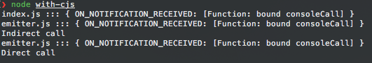
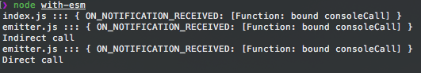

# std-esm-events

A failing example of the EventEmitter observer pattern using @std/esm & cjs : true

## CJS

```
node with-cjs
```



## ESM

```
node with-esm
```



## ESM with cjs : true

```
node with-esm-cjs
```


